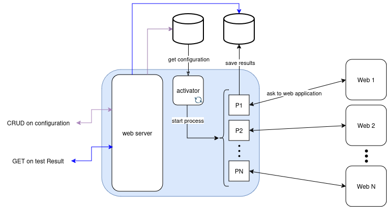

# MONITORINGO

## Introduction 

Monitoringo it's a simple project to discover golang, the main target is create knowledge on this language, to do this I have taken the decision to develop a monitoring platform over HTTP and HTTPS Method.

There isn't the pride to create something new, but thank you if you are reading this.

## Project Solution

My idea is, create a monitoring platform where the main server expose APIs to do CRUD operations for configuration where are saved the details to do the monitoring request.

The result of request it's saved in a othe table that show the historical progress of the healthy check



### Objects structure

The `configuration` object defines the structure of a record with the following fields:

| Field         | Type               | Description                                                                                             |
|---------------|--------------------|---------------------------------------------------------------------------------------------------------|
| `method`    | `string`           | HTTP method to use. Acceptable values: `GET`, `POST`, `PUT`, `DEL`.                                     |
| `path`         | `string`           | The URL to be accessed (e.g., `https://www.google.com/`).                                               |
| `response`    | `json` (optional)  | Default: `{ response_range: "200 - 499", message: null }`. Contains:                                    |
|               |                    | - `response_range` (`string`): Expected range of HTTP response codes. Default: `"200 - 499"`.           |
|               |                    | - `message` (`string`): Optional custom message. Default: `null`.                                      |
| `interval`    | `int`              | Interval in seconds for execution. Default: `60`.                                                      |
| `is_active`   | `boolean`          | Indicates whether the configuration is active.                                                         |
| `last_update` | `timestamp`        | Timestamp of the last update. **Not editable by the user.**                                            |

#### Example:
```json
{
    "Method": "GET",
    "url": "https://www.google.com/",
    "response": {
        "response_range": "200 - 499",
        "message": null
    },
    "interval": 60,
    "is_active": true,
    "last_update": "2024-11-22T10:00:00Z"
}
```

This record gives us all information useful to create the alert.

## Files

- [Draw of the Solution Diagram](./files/MonitorinGo.drawio)  
  A diagram illustrating the solution structure and flow.